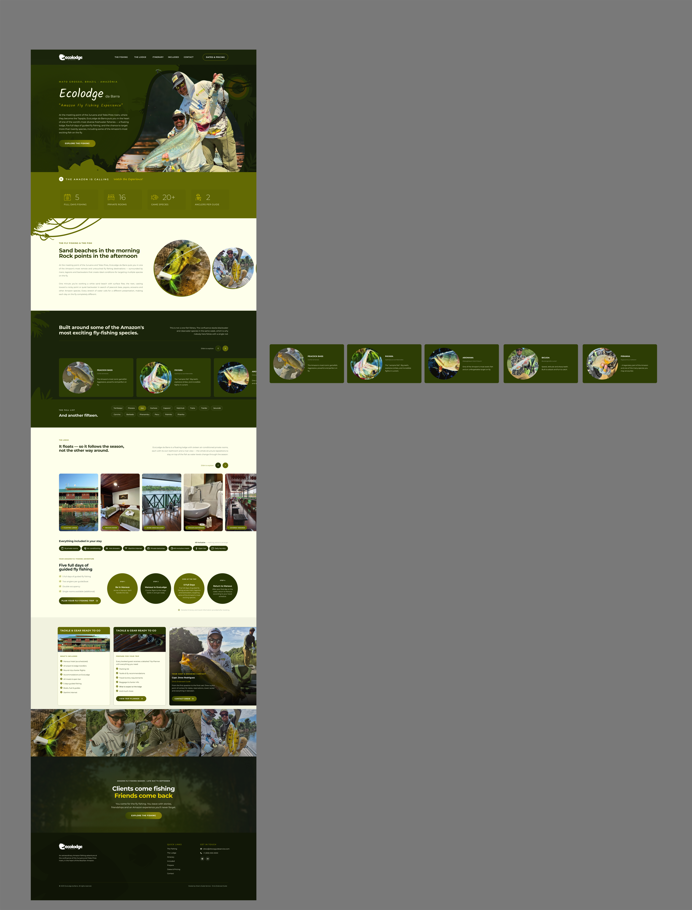

# Figma Design Specifications - Drew's Guide Service Barra Ecolodge dedicated page (Copy) (Copy)

This document contains the complete design specifications extracted from the Figma file.

## Complete Design Screenshot



## Design System

### Color Palette

```css
/* Background Colors */
--color-bg-youtube: #FFFFFF;
--color-bg-frame-1437256095: #C4C4C4;
--color-bg-page-2: #989898;
--color-bg-frame-1437256050: #5F6604;
--color-bg-photo-tag: #0F160F;
--color-bg-nav: #1A240B;
--color-bg-frame-145543: #636A04;
--color-bg-frame-1437256102: #111707;
--color-bg-pseudo-before: #8FB084;
--color-bg-frame-145520: #000000;
--color-bg-chk: #427740;
--color-bg-frame-1437256075: #2D3D05;
--color-bg-car-slide: #16211A;
--color-bg-frame-1437256090: #F1F2DF;
--color-bg-col-card: #FEFFEB;

```

### Typography

```css
/* Font Family */
--font-primary: 'Montserrat', system-ui, -apple-system, sans-serif;

/* Font Sizes */
--text-xl: 14px;
--text-2xl: 14px;
--text-3xl: 16px;
--text-4xl: 17px;
--text-xs: 11px;
--text-sm: 12px;
--text-base: 12px;
--text-lg: 13px;

/* Font Weights */
--font-piranha: 500;
--font-p: 400;
--font-private-room: 700;
--font-your-ecolodge-advent: 700;
--font-covered-veranda: 700;
--font-label: 500;
--font-5-full-days-of-guide: 400;
--font-two-anglers-per-guid: 400;
--font-all-airport--lodge-: 400;
--font-barbado: 500;
--font-link: 400;
--font-5: 200;
--font-hint: 400;
--font-step-lbl: 700;
--font-footer-col-title: 700;
--font-trairo: 500;
--font-pacu: 500;
--font-the-lodge: 700;
--font-note: 400;
--font-h1: 300;
--font-script: 400;
--font-subtext: 400;
--font-heading-3: 700;
--font-matrinx: 500;
--font-manaus-hotel-as-sch: 400;
--font-all-meals--open-bar: 400;
--font-season-runs-septembe: 700;
--font-latin: 400;
--font-river-view-balcony: 700;
--font-private-bathroom: 700;
--font-double-occupancy: 400;
--font-close-title: 400;
--font-small-inv: 400;
--font-span: 400;
--font-20: 200;
--font-h2: 700;
--font-title: 700;
--font-detailed-itinerary-a: 400;
--font-dates--pricing: 700;
--font-why-anglers-come-her: 700;
--font-trara: 500;
--font-common: 700;
--font-prepare-media-label: 700;
--font-fact-v: 400;
--font-pirarara: 500;
--font-jacund: 500;
--font-floating-lodge: 700;
--font-h4: 700;
--font-italic-note: 400;
--font-caparari: 500;
--font-palmito: 500;
--font-starlink-internet: 400;
--font-body-inv: 400;
--font-eyebrow: 700;
--font-the-amazon-is-calling: 600;
--font-body: 400;
--font-prepare-for-your-tri: 700;
--font-tambaqui: 500;
--font-piranambu: 500;
--font-lounge-deck: 700;
--font-accommodations-at-ec: 400;
--font-5-days-guided-fishin: 400;
--font-cachara: 500;
--font-single-rooms-availab: 400;
--font-lede: 400;
--font-2: 200;
--font-open-bar: 700;
--font-16: 200;
--font-whats-swimming-here: 700;
--font-round-trip-charter-f: 400;
--font-boats-fuel--guides: 400;
--font-close-lede: 400;

/* Line Heights */
--leading-lede: 30px;
--leading-heading-3: 34px;
--leading-label: 20px;
--leading-h2: 46px;
--leading-pirarara: 18px;
--leading-common: 20px;
--leading-detailed-itinerary-a: 16px;
--leading-footer-col-title: 19px;
--leading-title: 34px;
--leading-cachara: 18px;
--leading-private-room: 18px;
--leading-h4: 22px;
--leading-round-trip-charter-f: 22px;
--leading-trairo: 18px;
--leading-prepare-for-your-tri: 20px;
--leading-5-days-guided-fishin: 22px;
--leading-h1: 36px;
--leading-16: 31px;
--leading-5-full-days-of-guide: 22px;
--leading-dates--pricing: 21px;
--leading-script: 26px;
--leading-tambaqui: 18px;
--leading-the-lodge: 14px;
--leading-floating-lodge: 18px;
--leading-5: 31px;
--leading-matrinx: 18px;
--leading-barbado: 18px;
--leading-pacu: 18px;
--leading-piranha: 18px;
--leading-latin: 15px;
--leading-note: 15px;
--leading-single-rooms-availab: 22px;
--leading-body: 24px;
--leading-subtext: 30px;
--leading-p: 24px;
--leading-private-bathroom: 18px;
--leading-covered-veranda: 18px;
--leading-all-airport--lodge-: 22px;
--leading-all-meals--open-bar: 22px;
--leading-season-runs-septembe: 20px;
--leading-link: 24px;
--leading-eyebrow: 21px;
--leading-fact-v: 19px;
--leading-hint: 17px;
--leading-manaus-hotel-as-sch: 22px;
--leading-close-lede: 30px;
--leading-trara: 18px;
--leading-why-anglers-come-her: 20px;
--leading-span: 21px;
--leading-body-inv: 23px;
--leading-jacund: 18px;
--leading-your-ecolodge-advent: 14px;
--leading-step-lbl: 13px;
--leading-italic-note: 23px;
--leading-small-inv: 22px;
--leading-2: 31px;
--leading-caparari: 18px;
--leading-open-bar: 18px;
--leading-double-occupancy: 22px;
--leading-starlink-internet: 22px;
--leading-prepare-media-label: 18px;
--leading-whats-swimming-here: 20px;
--leading-piranambu: 18px;
--leading-two-anglers-per-guid: 22px;
--leading-accommodations-at-ec: 22px;
--leading-boats-fuel--guides: 22px;
--leading-the-amazon-is-calling: 31px;
--leading-20: 31px;
--leading-palmito: 18px;
--leading-river-view-balcony: 18px;
--leading-lounge-deck: 18px;
--leading-close-title: 15px;

```

### Spacing

```css
/* Spacing Scale */
--space-2: 8px;
--space-4: 10px;
--space-6: 12px;
--space-10: 16px;
--space-12: 17px;
--space-20: 21px;
--space-1: 7px;
--space-3: 9px;
--space-5: 11px;
--space-8: 15px;
--space-16: 20px;
--space-24: 22px;
```

### Border Radius

```css
--radius-sm: 12px;
--radius-md: 14px;
--radius-lg: 50px;
--radius-xl: 84px;
--radius-2xl: 100px;
--radius-full: 9999px; /* Full radius (circles) */
```

### Shadows

```css
--shadow-img-peacock-bass-taken-on-a-popper-in-the-shallows-of-the-tapajs: -6px 6px 0px #636A04;
--shadow-img-peacock-bass-taken-on-a-popper-in-the-shallows-of-the-tapajs: -6px 6px 0px #636A04;
--shadow-img-peacock-bass-taken-on-a-popper-in-the-shallows-of-the-tapajs: -6px 6px 0px #636A04;
--shadow-car-slide: 0px 10px 24px #000000;
--shadow-car-slide: 0px 10px 24px #000000;
--shadow-col-card: 0px 1px 2px #141E14;
--shadow-col-card: 0px 1px 2px #141E14;
```

## Layout Specifications

### Main Layout


## Exported Assets

| Asset | File | Format | Scale |
|-------|------|--------|-------|
| pseudo-after | `figma-assets/pseudo-after.png` | PNG | 1x |
| pseudo-after | `figma-assets/pseudo-after-2.png` | PNG | 1x |
| Rectangle 12 | `figma-assets/rectangle-12.png` | PNG | 1x |
| Rectangle 11 | `figma-assets/rectangle-11.png` | PNG | 1x |
| pseudo-after | `figma-assets/pseudo-after.png` | PNG | 1x |
| Img: Rod and reel wall at EcoLodge da Barra | `figma-assets/img-rod-and-reel-wall-at-ecolodge-da-barra.png` | PNG | 1x |
| pseudo-after | `figma-assets/pseudo-after-2.png` | PNG | 1x |
| pseudo-after | `figma-assets/pseudo-after-2.png` | PNG | 1x |
| Rectangle 20 | `figma-assets/rectangle-20.png` | PNG | 1x |
| Img: Lounge deck opening onto the river | `figma-assets/img-lounge-deck-opening-onto-the-river.png` | PNG | 1x |
| Rectangle 12 | `figma-assets/rectangle-12.png` | PNG | 1x |
| Rectangle 19 | `figma-assets/rectangle-19.png` | PNG | 1x |
| pseudo-after | `figma-assets/pseudo-after-2.png` | PNG | 1x |
| beach-sunset-with-trees 2 | `figma-assets/beach-sunset-with-trees-2.png` | PNG | 1x |
| Img: Peacock bass taken on a popper in the shallows of the Tapajós | `figma-assets/img-peacock-bass-taken-on-a-popper-in-the-shallows-of-the-tapajs-2.png` | PNG | 1x |
| pseudo-after | `figma-assets/pseudo-after-2.png` | PNG | 1x |
| Img: Open bar aboard the lodge | `figma-assets/img-open-bar-aboard-the-lodge.png` | PNG | 1x |
| pseudo-after | `figma-assets/pseudo-after-2.png` | PNG | 1x |
| pseudo-after | `figma-assets/pseudo-after-2.png` | PNG | 1x |
| Img: Peacock bass taken on a popper in the shallows of the Tapajós | `figma-assets/img-peacock-bass-taken-on-a-popper-in-the-shallows-of-the-tapajs.png` | PNG | 1x |
| Img: Rod and reel wall at EcoLodge da Barra | `figma-assets/img-rod-and-reel-wall-at-ecolodge-da-barra-2.png` | PNG | 1x |
| Img: Private bathroom with hot pressurised shower | `figma-assets/img-private-bathroom-with-hot-pressurised-shower.png` | PNG | 1x |
| Ellipse 6 | `figma-assets/ellipse-6.png` | PNG | 1x |
| pseudo-after | `figma-assets/pseudo-after-2.png` | PNG | 1x |
| pseudo-after | `figma-assets/pseudo-after-2.png` | PNG | 1x |
| pseudo-after | `figma-assets/pseudo-after-2.png` | PNG | 1x |
| pseudo-after | `figma-assets/pseudo-after-2.png` | PNG | 1x |
| Img: Air-conditioned private twin room | `figma-assets/img-air-conditioned-private-twin-room.png` | PNG | 1x |
| Img: Private balcony overlooking the river | `figma-assets/img-private-balcony-overlooking-the-river.png` | PNG | 1x |
| pseudo-after | `figma-assets/pseudo-after-2.png` | PNG | 1x |
| pseudo-after | `figma-assets/pseudo-after-2.png` | PNG | 1x |
| pseudo-after | `figma-assets/pseudo-after-2.png` | PNG | 1x |
| Rectangle 21 | `figma-assets/rectangle-21.png` | PNG | 1x |
| pseudo-after | `figma-assets/pseudo-after-2.png` | PNG | 1x |
| Img: Rod and reel wall at EcoLodge da Barra | `figma-assets/img-rod-and-reel-wall-at-ecolodge-da-barra-2.png` | PNG | 1x |
| Rectangle 11 | `figma-assets/rectangle-11.png` | PNG | 1x |
| Img: EcoLodge da Barra floating lodge exterior on the Tapajós River | `figma-assets/img-ecolodge-da-barra-floating-lodge-exterior-on-the-tapajs-river.png` | PNG | 1x |
| pseudo-after | `figma-assets/pseudo-after-2.png` | PNG | 1x |
| Img: Peacock bass taken on a popper in the shallows of the Tapajós | `figma-assets/img-peacock-bass-taken-on-a-popper-in-the-shallows-of-the-tapajs-2.png` | PNG | 1x |
| pseudo-after | `figma-assets/pseudo-after-2.png` | PNG | 1x |
| Img: Capt. Drew Rodriguez with a peacock bass on the Tapajós | `figma-assets/img-capt-drew-rodriguez-with-a-peacock-bass-on-the-tapajs.png` | PNG | 1x |
| Img: Covered veranda with tackle room | `figma-assets/img-covered-veranda-with-tackle-room.png` | PNG | 1x |
| pseudo-after | `figma-assets/pseudo-after-2.png` | PNG | 1x |
| pseudo-after | `figma-assets/pseudo-after-2.png` | PNG | 1x |
| pseudo-after | `figma-assets/pseudo-after-2.png` | PNG | 1x |

## Component Tree

Hierarchical node descriptions. Each indented line is a child.
Format: `[TYPE] Name WxH | property:value ...`

```
[SECTION] New - 23/09/26 | 5890x7742
  [FRAME] Drew's Guide Service Barra Ecolodge dedicated page v2  | 1920x7237 | layout:VERTICAL
    [FRAME] Frame 145540 | 1920x1042
      [VECTOR] Vector | 1955x1080
      [VECTOR] Ellipse 6 | 1416x1399
      [VECTOR] Ellipse 7 | 1166x1152
      [VECTOR] Vector | 1920x1279
      [VECTOR] Vector | 550x1079
      [FRAME] Frame 145541 | 1442x1158
        [GROUP] Group 11 | 253x253
          [ELLIPSE] Ellipse 7 | 253x253
          [ELLIPSE] Ellipse 8 | 197x197
          [ELLIPSE] Ellipse 9 | 157x157
          [ELLIPSE] Ellipse 10 | 95x95
        [FRAME] Frame 145542 | 744x241
          [GROUP] Group | 142x100
            [GROUP] Group | 142x100
              [VECTOR] Vector | 0x0
              [VECTOR] Vector | 142x100
            [VECTOR] Vector | 115x77
          [GROUP] Group | 339x166
            [VECTOR] Vector | 339x166
            [VECTOR] Vector | 339x166
            [VECTOR] Vector | 323x156
          [GROUP] Group | 35x95
            [GROUP] Group | 35x95
              [GROUP] Group | 35x91
                [VECTOR] Vector | 4x25
                [VECTOR] Vector | 35x85
                [VECTOR] Vector | 10x24
                [VECTOR] Vector | 0x9
                [VECTOR] Vector | 3x17
                [VECTOR] Vector | 16x27
                [VECTOR] Vector | 22x9
                [VECTOR] Vector | 13x9
                [VECTOR] Vector | 5x28
              [GROUP] Group | 19x26
                [VECTOR] Vector | 19x26
                [VECTOR] Vector | 3x3
                [VECTOR] Vector | 11x11
                [VECTOR] Vector | 16x19
              [GROUP] Group | 35x91
                [VECTOR] Vector | 4x25
                [VECTOR] Vector | 35x85
                [VECTOR] Vector | 10x24
                [VECTOR] Vector | 0x9
                [VECTOR] Vector | 3x17
                [VECTOR] Vector | 16x27
                [VECTOR] Vector | 22x9
                [VECTOR] Vector | 13x9
                [VECTOR] Vector | 5x28
          [VECTOR] Vector | 52x31
          [GROUP] Group | 88x44
            [VECTOR] Vector | 88x43
            [GROUP] Group | 38x9
              [VECTOR] Vector | 3x2
              [GROUP] Group | 38x9
                [VECTOR] Vector | 1x1
                [VECTOR] Vector | 38x9
            [VECTOR] Vector | 8x5
            [VECTOR] Vector | 7x7
          [VECTOR] Vector | 51x56
          [GROUP] Group | 97x63
            [VECTOR] Vector | 0x0
            [VECTOR] Vector | 97x63
          [GROUP] Group | 111x82
            [VECTOR] Vector | 111x82
            [VECTOR] Vector | 82x68
            [VECTOR] Vector | 69x41
            [VECTOR] Vector | 24x27
            [VECTOR] Vector | 8x16
            [VECTOR] Vector | 22x10
            [VECTOR] Vector | 32x16
            [VECTOR] Vector | 19x7
            [VECTOR] Vector | 15x10
            [VECTOR] Vector | 11x11
          [VECTOR] Vector | 37x35
          [VECTOR] Vector | 35x30
          [VECTOR] Vector | 33x29
          [VECTOR] Vector | 35x28
          [VECTOR] Vector | 5x5
          [VECTOR] Vector | 33x27
          [VECTOR] Vector | 31x24
          [VECTOR] Vector | 659x205
          [VECTOR] Vector | 658x205
          [VECTOR] Vector | 370x48
          [GROUP] Group | 22x12
            [VECTOR] Vector | 22x12
            [VECTOR] Vector | 17x10
            [VECTOR] Vector | 14x11
          [GROUP] Group | 25x7
            [VECTOR] Vector | 25x7
            [VECTOR] Vector | 20x5
            [VECTOR] Vector | 18x7
          [GROUP] Group | 22x12
            [VECTOR] Vector | 22x12
            [VECTOR] Vector | 17x10
            [VECTOR] Vector | 14x11
          [GROUP] Group | 27x9
            [VECTOR] Vector | 27x9
            [VECTOR] Vector | 21x5
            [VECTOR] Vector | 21x9
          [GROUP] Group | 21x14
            [VECTOR] Vector | 21x14
            [VECTOR] Vector | 18x9
            [VECTOR] Vector | 16x10
          [GROUP] Group | 13x22
            [VECTOR] Vector | 13x22
            [VECTOR] Vector | 8x17
            [VECTOR] Vector | 8x17
          [GROUP] Group | 27x9
            [VECTOR] Vector | 27x9
            [VECTOR] Vector | 21x5
            [VECTOR] Vector | 21x9
          [GROUP] Group | 21x14
            [VECTOR] Vector | 21x14
            [VECTOR] Vector | 18x9
            [VECTOR] Vector | 16x10
          [GROUP] Group | 27x9
            [VECTOR] Vector | 27x9
            [VECTOR] Vector | 21x5
            [VECTOR] Vector | 21x9
          [VECTOR] Vector | 430x139
          [VECTOR] Vector | 129x114
          [VECTOR] Vector | 23x20
          [VECTOR] Vector | 20x13
          [GROUP] Group | 88x84
            [VECTOR] Vector | 88x84
            [VECTOR] Vector | 72x69
            [VECTOR] Vector | 69x42
            [VECTOR] Vector | 23x31
            [VECTOR] Vector | 13x18
            [VECTOR] Vector | 9x18
            [VECTOR] Vector | 22x14
          [GROUP] Group | 64x94
            [VECTOR] Vector | 64x94
            [VECTOR] Vector | 52x61
            [VECTOR] Vector | 3x5
            [VECTOR] Vector | 8x21
            [VECTOR] Vector | 7x18
            [VECTOR] Vector | 16x34
            [VECTOR] Vector | 9x26
            [VECTOR] Vector | 10x20
            [VECTOR] Vector | 27x13
            [VECTOR] Vector | 22x12
            [VECTOR] Vector | 26x13
          [VECTOR] Vector | 369x100
          [VECTOR] Vector | 369x100
          [VECTOR] Vector | 356x96
          [VECTOR] Vector | 35x12
          [VECTOR] Vector | 33x11
          [GROUP] Group | 39x69
            [VECTOR] Vector | 39x69
            [VECTOR] Vector | 32x65
            [VECTOR] Vector | 30x62
            [VECTOR] Vector | 28x64
            [VECTOR] Vector | 5x6
            [VECTOR] Vector | 6x9
            [VECTOR] Vector | 29x61
            [VECTOR] Vector | 24x58
          [GROUP] Group | 25x77
            [VECTOR] Vector | 25x77
            [VECTOR] Vector | 12x73
            [VECTOR] Vector | 8x69
            [VECTOR] Vector | 15x70
            [VECTOR] Vector | 4x7
            [VECTOR] Vector | 4x10
            [VECTOR] Vector | 14x67
            [VECTOR] Vector | 8x62
          [GROUP] Group | 55x16
            [VECTOR] Vector | 55x16
            [VECTOR] Vector | 55x16
          [GROUP] Group | 37x24
            [VECTOR] Vector | 36x24
            [VECTOR] Vector | 2x2
            [VECTOR] Vector | 3x4
            [VECTOR] Vector | 20x20
            [VECTOR] Vector | 29x21
          [VECTOR] Vector | 39x10
          [VECTOR] Vector | 7x4
          [VECTOR] Vector | 30x8
          [GROUP] Group | 19x29
            [VECTOR] Vector | 19x29
            [VECTOR] Vector | 13x26
            [VECTOR] Vector | 15x24
          [GROUP] Group | 41x78
            [VECTOR] Vector | 1x1
            [VECTOR] Vector | 40x78
            [VECTOR] Vector | 16x42
            [VECTOR] Vector | 8x14
            [VECTOR] Vector | 16x27
            [VECTOR] Vector | 22x9
            [VECTOR] Vector | 13x9
            [VECTOR] Vector | 11x28
          [GROUP] Group | 64x115
            [GROUP] Group | 64x115
              [VECTOR] Vector | 63x115
              [VECTOR] Vector | 1x2
              [VECTOR] Vector | 34x63
              [VECTOR] Vector | 17x37
              [VECTOR] Vector | 5x13
              [VECTOR] Vector | 0x2
              [VECTOR] Vector | 19x31
              [VECTOR] Vector | 26x10
              [VECTOR] Vector | 15x11
              [VECTOR] Vector | 18x35
              [VECTOR] Vector | 5x18
        [VECTOR] Ellipse 6 | 1099x1086 | asset:figma-assets/ellipse-6.png
        [ELLIPSE] Ellipse 12 | 312x312
        [GROUP] Group 8 | 1506x1242
          [GROUP] Mask group | 1099x1086
            [VECTOR] Ellipse 8 | 1099x1086
            [RECTANGLE] Rectangle 11 | 1506x1257 | asset:figma-assets/rectangle-11.png | asset:figma-assets/rectangle-11.png
          [RECTANGLE] Rectangle 12 | 1506x803 | asset:figma-assets/rectangle-12.png | asset:figma-assets/rectangle-12.png
        [ELLIPSE] Ellipse 11 | 103x103
        [GROUP] SVGID_00000114754310336816633690000011280816433773342082_ | 732x240
          [VECTOR] Vector | 732x240
      [FRAME] nav | 1920x129 | layout:VERTICAL | pad:0,231,0,231 | gap:40
        [FRAME] Frame 145530 | 1440x59 | layout:HORIZONTAL | gap:174
          [FRAME] Img: EcoLodge da Barra | 200x52
            [GROUP] Camada 1 | 200x52
              [GROUP] Group | 200x52
                [VECTOR] Vector | 200x52
          [FRAME] Frame 145531 | 966x59 | layout:HORIZONTAL | gap:60
            [FRAME] Frame 145528 | 689x22 | layout:HORIZONTAL | gap:25
              [TEXT] Link | 142x22 | "The Fishing" | font:Montserrat/16px/w600 | align:LEFT
              [TEXT] Link | 130x22 | "The Lodge" | font:Montserrat/16px/w600 | align:LEFT
              [TEXT] Link | 107x22 | "Itinerary" | font:Montserrat/16px/w600 | align:LEFT
              [TEXT] Link | 109x22 | "Included" | font:Montserrat/16px/w600 | align:LEFT
              [TEXT] Link | 101x22 | "Contact" | font:Montserrat/16px/w600 | align:LEFT
            [FRAME] Frame 145529 | 217x59 | radius:84 | layout:HORIZONTAL | pad:10,10,10,10 | gap:10
              [TEXT] Dates & Pricing | 160x19 | "Dates & Pricing" | font:Montserrat/16px/w700 | align:LEFT
      [VECTOR] Vector | 525x673
      [ELLIPSE] Ellipse 12 | 472x472
      [ELLIPSE] Ellipse 14 | 472x472
      [ELLIPSE] Ellipse 15 | 472x472
      [GROUP] Group 10 | 743x565
        [GROUP] Group 9 | 743x89
          [TEXT] h1 | 410x89 | "Ecolodge" | font:Kalam/104px/w400 | align:LEFT
          [TEXT] h1 | 348x41 | "da Barra" | font:Montserrat/28px/w400 | align:LEFT
        [TEXT] eyebrow | 720x22 | "Mato Grosso, Brazil · Amazônia" | font:Montserrat/18px/w600 | align:LEFT
        [TEXT] h1 | 668x30 | "“Amazon Fly Fishing Experience”" | font:Kalam/30px/w300 | align:LEFT
        [FRAME] Frame 145534 | 619x287 | layout:VERTICAL | gap:48
          [TEXT] lede | 618x180 | "At the meeting point of the Juruena and Teles Pires rivers, where they become th..." | font:Montserrat/18px/w400 | align:LEFT
          [FRAME] Frame 145530 | 311x59 | radius:84 | layout:HORIZONTAL | pad:10,10,10,10 | gap:10
            [TEXT] Dates & Pricing | 210x22 | "Explore The Fishing" | font:Montserrat/16px/w700 | align:LEFT
      [VECTOR] Vector | 431x207
      [ELLIPSE] Ellipse 13 | 13x13
    [FRAME] Frame 145522 | 1920x120 | layout:VERTICAL | pad:16,300,17,507 | gap:40
      [FRAME] Frame 145514 | 1647x38 | layout:HORIZONTAL | gap:40
        [FRAME] Frame 145538 | 426x38 | layout:HORIZONTAL | gap:20
          [VECTOR] Vector | 38x38
          [TEXT] THE AMAZON IS CALLING | 368x26 | "THE AMAZON IS CALLING" | font:Montserrat/19px/w600 | align:LEFT
        [TEXT] script | 761x26 | "Watch the Experience!" | font:Segoe Print/22px/w400 | align:LEFT
    [FRAME] Frame 145543 | 1920x273
      [FRAME] Frame 1437256055 | 1440x172 | layout:HORIZONTAL | gap:32
        [FRAME] Frame 1437256049 | 325x172 | radius:12
          [FRAME] Frame 1437256054 | 201x101 | layout:VERTICAL | gap:22
            [FRAME] Frame 1437256053 | 131x60 | layout:HORIZONTAL | gap:36
              [FRAME] calendar_5220111 1 | 60x60
                [VECTOR] Vector | 55x55
              [TEXT] 5 | 35x42 | "5" | font:Montserrat/62px/w200 | align:LEFT
            [TEXT] fact-v | 201x19 | "Full days fishing" | font:Montserrat/18px/w400 | align:LEFT
        [FRAME] Frame 1437256050 | 325x172 | radius:12
          [FRAME] Frame 1437256054 | 201x101 | layout:VERTICAL | gap:22
            [FRAME] Frame 1437256053 | 157x60 | layout:HORIZONTAL | gap:36
              [FRAME] bedroom_4804563 1 | 60x60
                [VECTOR] Vector | 55x46
              [TEXT] 16 | 61x42 | "16" | font:Montserrat/62px/w200 | align:LEFT
            [TEXT] fact-v | 201x19 | "Private rooms" | font:Montserrat/18px/w400 | align:LEFT
        [FRAME] Frame 1437256051 | 325x172 | radius:12
          [FRAME] Frame 1437256054 | 201x101 | layout:VERTICAL | gap:22
            [FRAME] Frame 1437256053 | 272x60 | layout:HORIZONTAL | gap:36
              [FRAME] fish_2237278 1 | 60x60
                [VECTOR] Vector | 60x43
              [TEXT] 20+ | 176x42 | "20+" | font:Montserrat/62px/w200 | align:LEFT
            [TEXT] fact-v | 201x19 | "Game species" | font:Montserrat/18px/w400 | align:LEFT
        [FRAME] Frame 1437256052 | 325x172 | radius:12
          [FRAME] Frame 1437256054 | 201x101 | layout:VERTICAL | gap:22
            [FRAME] Frame 1437256053 | 131x60 | layout:HORIZONTAL | gap:36
              [FRAME] fisherman_6509384 1 | 60x60
                [VECTOR] Vector | 45x55
              [TEXT] 2 | 35x42 | "2" | font:Montserrat/62px/w200 | align:LEFT
            [TEXT] fact-v | 251x19 | "Anglers per guide" | font:Montserrat/18px/w400 | align:LEFT
    [FRAME] Frame 1437256056 | 1920x786
      [FRAME] Frame 1437256059 | 2029x478 | layout:HORIZONTAL | gap:98
        [FRAME] Frame 1437256057 | 713x460 | layout:VERTICAL | gap:30
          [TEXT] Why anglers come her... | 713x20 | "THE FLY FISHING & THE FISH" | font:Montserrat/16px/w700 | align:LEFT
          [FRAME] Frame 145520 | 713x410 | layout:VERTICAL | gap:40
            [TEXT] h2 | 713x92 | "Sand beaches in the morning Rock points in the afternoon" | font:Montserrat/46px/w700 | align:LEFT
            [FRAME] Frame 145516 | 713x278 | layout:VERTICAL | gap:38
              [TEXT] body | 713x120 | "At the meeting point of the Juruena and Teles Pires, EcoLodge da Barra puts you ..." | font:Montserrat/16px/w400 | align:JUSTIFIED
              [TEXT] body | 713x120 | "One minute you’re working a white sand beach with surface flies; the next, cas..." | font:Montserrat/16px/w400 | align:JUSTIFIED
        [FRAME] Frame 1437256058 | 1218x478 | layout:HORIZONTAL | gap:22
          [RECTANGLE] Img: Peacock bass taken on a popper in the shallows of the Tapajós | 478x478 | radius:460 | shadow:DROP_SHADOW/-6,6,0/#636A04 | asset:figma-assets/img-peacock-bass-taken-on-a-popper-in-the-shallows-of-the-tapajs.png
          [RECTANGLE] Img: Peacock bass taken on a popper in the shallows of the Tapajós | 348x348 | radius:487 | shadow:DROP_SHADOW/-6,6,0/#636A04 | asset:figma-assets/img-peacock-bass-taken-on-a-popper-in-the-shallows-of-the-tapajs-2.png
          [RECTANGLE] Img: Peacock bass taken on a popper in the shallows of the Tapajós | 348x348 | radius:377 | shadow:DROP_SHADOW/-6,6,0/#636A04 | asset:figma-assets/img-peacock-bass-taken-on-a-popper-in-the-shallows-of-the-tapajs-2.png
      [FRAME] Frame 145542 | 744x241
        [GROUP] Group | 142x100
          [GROUP] Group | 142x100
            [VECTOR] Vector | 0x0
            [VECTOR] Vector | 142x100
          [VECTOR] Vector | 115x77
        [GROUP] Group | 339x166
          [VECTOR] Vector | 339x166
          [VECTOR] Vector | 339x166
          [VECTOR] Vector | 323x156
        [GROUP] Group | 35x95
          [GROUP] Group | 35x95
            [GROUP] Group | 35x91
              [VECTOR] Vector | 4x25
              [VECTOR] Vector | 35x85
              [VECTOR] Vector | 10x24
              [VECTOR] Vector | 0x9
              [VECTOR] Vector | 3x17
              [VECTOR] Vector | 16x27
              [VECTOR] Vector | 22x9
              [VECTOR] Vector | 13x9
              [VECTOR] Vector | 5x28
            [GROUP] Group | 19x26
              [VECTOR] Vector | 19x26
              [VECTOR] Vector | 3x3
              [VECTOR] Vector | 11x11
              [VECTOR] Vector | 16x19
            [GROUP] Group | 35x91
              [VECTOR] Vector | 4x25
              [VECTOR] Vector | 35x85
              [VECTOR] Vector | 10x24
              [VECTOR] Vector | 0x9
              [VECTOR] Vector | 3x17
              [VECTOR] Vector | 16x27
              [VECTOR] Vector | 22x9
              [VECTOR] Vector | 13x9
              [VECTOR] Vector | 5x28
        [VECTOR] Vector | 52x31
        [GROUP] Group | 88x44
          [VECTOR] Vector | 88x43
          [GROUP] Group | 38x9
            [VECTOR] Vector | 3x2
            [GROUP] Group | 38x9
              [VECTOR] Vector | 1x1
              [VECTOR] Vector | 38x9
          [VECTOR] Vector | 8x5
          [VECTOR] Vector | 7x7
        [VECTOR] Vector | 51x56
        [GROUP] Group | 97x63
          [VECTOR] Vector | 0x0
          [VECTOR] Vector | 97x63
        [GROUP] Group | 111x82
          [VECTOR] Vector | 111x82
          [VECTOR] Vector | 82x68
          [VECTOR] Vector | 69x41
          [VECTOR] Vector | 24x27
          [VECTOR] Vector | 8x16
          [VECTOR] Vector | 22x10
          [VECTOR] Vector | 32x16
          [VECTOR] Vector | 19x7
          [VECTOR] Vector | 15x10
          [VECTOR] Vector | 11x11
        [VECTOR] Vector | 37x35
        [VECTOR] Vector | 35x30
        [VECTOR] Vector | 33x29
        [VECTOR] Vector | 35x28
        [VECTOR] Vector | 5x5
        [VECTOR] Vector | 33x27
        [VECTOR] Vector | 31x24
        [VECTOR] Vector | 659x205
        [VECTOR] Vector | 658x205
        [VECTOR] Vector | 370x48
        [GROUP] Group | 22x12
          [VECTOR] Vector | 22x12
          [VECTOR] Vector | 17x10
          [VECTOR] Vector | 14x11
        [GROUP] Group | 25x7
          [VECTOR] Vector | 25x7
          [VECTOR] Vector | 20x5
          [VECTOR] Vector | 18x7
        [GROUP] Group | 22x12
          [VECTOR] Vector | 22x12
          [VECTOR] Vector | 17x10
          [VECTOR] Vector | 14x11
        [GROUP] Group | 27x9
          [VECTOR] Vector | 27x9
          [VECTOR] Vector | 21x5
          [VECTOR] Vector | 21x9
        [GROUP] Group | 21x14
          [VECTOR] Vector | 21x14
          [VECTOR] Vector | 18x9
          [VECTOR] Vector | 16x10
        [GROUP] Group | 13x22
          [VECTOR] Vector | 13x22
          [VECTOR] Vector | 8x17
          [VECTOR] Vector | 8x17
        [GROUP] Group | 27x9
          [VECTOR] Vector | 27x9
          [VECTOR] Vector | 21x5
          [VECTOR] Vector | 21x9
        [GROUP] Group | 21x14
          [VECTOR] Vector | 21x14
          [VECTOR] Vector | 18x9
          [VECTOR] Vector | 16x10
        [GROUP] Group | 27x9
          [VECTOR] Vector | 27x9
          [VECTOR] Vector | 21x5
          [VECTOR] Vector | 21x9
        [VECTOR] Vector | 430x139
        [VECTOR] Vector | 129x114
        [VECTOR] Vector | 23x20
        [VECTOR] Vector | 20x13
        [GROUP] Group | 88x84
          [VECTOR] Vector | 88x84
          [VECTOR] Vector | 72x69
          [VECTOR] Vector | 69x42
          [VECTOR] Vector | 23x31
          [VECTOR] Vector | 13x18
          [VECTOR] Vector | 9x18
          [VECTOR] Vector | 22x14
        [GROUP] Group | 64x94
          [VECTOR] Vector | 64x94
          [VECTOR] Vector | 52x61
          [VECTOR] Vector | 3x5
          [VECTOR] Vector | 8x21
          [VECTOR] Vector | 7x18
          [VECTOR] Vector | 16x34
          [VECTOR] Vector | 9x26
          [VECTOR] Vector | 10x20
          [VECTOR] Vector | 27x13
          [VECTOR] Vector | 22x12
          [VECTOR] Vector | 26x13
        [VECTOR] Vector | 369x100
        [VECTOR] Vector | 369x100
        [VECTOR] Vector | 356x96
        [VECTOR] Vector | 35x12
        [VECTOR] Vector | 33x11
        [GROUP] Group | 39x69
          [VECTOR] Vector | 39x69
          [VECTOR] Vector | 32x65
          [VECTOR] Vector | 30x62
          [VECTOR] Vector | 28x64
          [VECTOR] Vector | 5x6
          [VECTOR] Vector | 6x9
          [VECTOR] Vector | 29x61
          [VECTOR] Vector | 24x58
        [GROUP] Group | 25x77
          [VECTOR] Vector | 25x77
          [VECTOR] Vector | 12x73
          [VECTOR] Vector | 8x69
          [VECTOR] Vector | 15x70
          [VECTOR] Vector | 4x7
          [VECTOR] Vector | 4x10
          [VECTOR] Vector | 14x67
          [VECTOR] Vector | 8x62
        [GROUP] Group | 55x16
          [VECTOR] Vector | 55x16
          [VECTOR] Vector | 55x16
        [GROUP] Group | 37x24
          [VECTOR] Vector | 36x24
          [VECTOR] Vector | 2x2
          [VECTOR] Vector | 3x4
          [VECTOR] Vector | 20x20
          [VECTOR] Vector | 29x21
        [VECTOR] Vector | 39x10
        [VECTOR] Vector | 7x4
        [VECTOR] Vector | 30x8
        [GROUP] Group | 19x29
          [VECTOR] Vector | 19x29
          [VECTOR] Vector | 13x26
          [VECTOR] Vector | 15x24
        [GROUP] Group | 41x78
          [VECTOR] Vector | 1x1
          [VECTOR] Vector | 40x78
          [VECTOR] Vector | 16x42
          [VECTOR] Vector | 8x14
          [VECTOR] Vector | 16x27
          [VECTOR] Vector | 22x9
          [VECTOR] Vector | 13x9
          [VECTOR] Vector | 11x28
        [GROUP] Group | 64x115
          [GROUP] Group | 64x115
            [VECTOR] Vector | 63x115
            [VECTOR] Vector | 1x2
            [VECTOR] Vector | 34x63
            [VECTOR] Vector | 17x37
            [VECTOR] Vector | 5x13
            [VECTOR] Vector | 0x2
            [VECTOR] Vector | 19x31
            [VECTOR] Vector | 26x10
            [VECTOR] Vector | 15x11
            [VECTOR] Vector | 18x35
            [VECTOR] Vector | 5x18
    [FRAME] Frame 1437256060 | 1920x994
      [VECTOR] Vector | 536x1053
      [FRAME] Frame 1437256064 | 1440x138 | layout:VERTICAL | gap:46
        [FRAME] Frame 1437256062 | 1440x92 | layout:HORIZONTAL | gap:40
          [TEXT] title | 742x92 | "Built around some of the Amazon's most exciting fly-fishing species." | font:Montserrat/40px/w700 | align:LEFT
          [TEXT] subtext | 501x78 | "This is not a one-fish fishery. The confluence stacks blackwater and clearwater ..." | font:Montserrat/16px/w400 | align:RIGHT
        [LINE] Line 1 | 1440x0
      [FRAME] Frame 1437256066 | 1920x239
        [FRAME] tag-section | 1440x110
          [FRAME] Frame 1437256065 | 345x96 | layout:VERTICAL | gap:12
            [TEXT] What's swimming here | 345x20 | "the full list" | font:Montserrat/12px/w700 | align:LEFT
            [TEXT] Heading 3 | 345x36 | "And another fifteen." | font:Montserrat/32px/w700 | align:LEFT
          [FRAME] tag-cloud | 996x104
            [FRAME] tag | 110x42 | radius:100
              [TEXT] Tambaqui | 75x18 | "Tambaqui" | font:Montserrat/14px/w500 | align:LEFT
            [FRAME] tag | 96x42 | radius:100
              [TEXT] Pirarara | 57x18 | "Pirarara" | font:Montserrat/14px/w500 | align:LEFT
            [FRAME] tag | 100x42 | radius:100
              [TEXT] Cachara | 60x18 | "Cachara" | font:Montserrat/14px/w500 | align:LEFT
            [FRAME] tag | 102x42 | radius:100
              [TEXT] Caparari | 62x18 | "Caparari" | font:Montserrat/14px/w500 | align:LEFT
            [FRAME] tag | 103x42 | radius:100
              [TEXT] Matrinxã | 65x18 | "Matrinxã" | font:Montserrat/14px/w500 | align:LEFT
            [FRAME] tag | 82x42 | radius:100
              [TEXT] Traíra | 41x18 | "Traíra" | font:Montserrat/14px/w500 | align:LEFT
            [FRAME] tag | 91x42 | radius:100
              [TEXT] Trairão | 50x18 | "Trairão" | font:Montserrat/14px/w500 | align:LEFT
            [FRAME] tag | 102x42 | radius:100
              [TEXT] Jacundá | 63x18 | "Jacundá" | font:Montserrat/14px/w500 | align:LEFT
            [FRAME] tag | 101x42 | radius:100
              [TEXT] Barbado | 64x18 | "Barbado" | font:Montserrat/14px/w500 | align:LEFT
            [FRAME] tag | 101x42 | radius:100
              [TEXT] Barbado | 57x18 | "Corvina" | font:Montserrat/14px/w500 | align:CENTER
            [FRAME] tag | 116x42 | radius:100
              [TEXT] Piranambu | 83x18 | "Piranambu" | font:Montserrat/14px/w500 | align:LEFT
            [FRAME] tag | 77x42 | radius:100
              [TEXT] Pacu | 38x18 | "Pacu" | font:Montserrat/14px/w500 | align:LEFT
            [FRAME] tag | 93x42 | radius:100
              [TEXT] Palmito | 58x18 | "Palmito" | font:Montserrat/14px/w500 | align:LEFT
            [FRAME] tag | 95x42 | radius:100
              [TEXT] Piranha | 57x18 | "Piranha" | font:Montserrat/14px/w500 | align:LEFT
            [FRAME] tag | 67x42 | radius:100
              [TEXT] Pirarara | 26x18 | "Jaú" | font:Montserrat/14px/w500 | align:CENTER
      [FRAME] carousel-controls | 232x54
        [TEXT] hint | 108x17 | "Slide to explore" | font:Montserrat/14px/w400 | align:LEFT
        [FRAME] prevBtn | 48x48 | radius:50
          [FRAME] svg | 18x18
            [VECTOR] Vector | 4x9
        [FRAME] nextBtn | 48x48 | radius:50
          [FRAME] svg | 18x18
            [VECTOR] Vector | 4x9
      [FRAME] Frame 1437256104 | 3297x376
        [FRAME] Frame 1437256072 | 633x330 | radius:12 | layout:HORIZONTAL | pad:30,30,30,30 | gap:24
          [FRAME] pseudo-after | 270x270 | radius:245 | asset:figma-assets/pseudo-after-2.png
          [FRAME] Frame 1437256068 | 260x147 | layout:VERTICAL | gap:28
            [FRAME] Frame 1437256067 | 260x47 | layout:VERTICAL | gap:12
              [TEXT] common | 260x20 | "Peacock Bass" | font:Montserrat/16px/w700 | align:LEFT
              [TEXT] latin | 97x15 | "Cichla temensis" | font:Montserrat/12px/w400 | align:LEFT
            [TEXT] p | 260x72 | "The Amazon's most iconic gamefish. Aggressive, powerful and perfect on fly." | font:Montserrat/14px/w400 | align:LEFT
        [FRAME] Frame 1437256073 | 633x330 | radius:12 | layout:HORIZONTAL | pad:30,30,30,30 | gap:24
          [FRAME] card-photo | 270x270 | radius:245
            [RECTANGLE] ph-icon | 16x16
            [FRAME] pseudo-after | 270x337 | asset:figma-assets/pseudo-after.png | asset:figma-assets/pseudo-after-2.png
              [FRAME] pseudo-after | 276x276 | radius:179 | asset:figma-assets/pseudo-after-2.png
            [RECTANGLE] ph-label | 11x11 | radius:100
          [FRAME] Frame 1437256068 | 260x147 | layout:VERTICAL | gap:28
            [FRAME] Frame 1437256067 | 260x47 | layout:VERTICAL | gap:12
              [TEXT] common | 260x20 | "Payara" | font:Montserrat/16px/w700 | align:LEFT
              [TEXT] latin | 260x15 | "Hydrolycus scomberoides" | font:Montserrat/12px/w400 | align:LEFT
            [TEXT] p | 260x72 | "The “vampire fish”. Big teeth, explosive strikes, and incredible fights in c..." | font:Montserrat/14px/w400 | align:LEFT
        [FRAME] Frame 1437256074 | 633x330 | radius:12 | layout:HORIZONTAL | pad:30,30,30,30 | gap:24
          [FRAME] pseudo-after | 270x270 | radius:245 | asset:figma-assets/pseudo-after-2.png
            [FRAME] pseudo-after | 270x270 | radius:179 | asset:figma-assets/pseudo-after-2.png
          [FRAME] Frame 1437256068 | 260x123 | layout:VERTICAL | gap:28
            [FRAME] Frame 1437256067 | 260x47 | layout:VERTICAL | gap:12
              [TEXT] common | 260x20 | "Arowana" | font:Montserrat/16px/w700 | align:LEFT
              [TEXT] latin | 260x15 | "Osteoglossum bicirrhosum" | font:Montserrat/12px/w400 | align:LEFT
            [TEXT] p | 260x48 | "One of the Amazon's most exotic fish and an unforgettable target on fly." | font:Montserrat/14px/w400 | align:LEFT
        [FRAME] Frame 1437256075 | 633x330 | radius:12 | layout:HORIZONTAL | pad:30,30,30,30 | gap:24
          [FRAME] pseudo-after | 270x270 | radius:245 | asset:figma-assets/pseudo-after-2.png
            [FRAME] pseudo-after | 270x270 | radius:179 | asset:figma-assets/pseudo-after-2.png
          [FRAME] Frame 1437256068 | 260x123 | layout:VERTICAL | gap:28
            [FRAME] Frame 1437256067 | 260x47 | layout:VERTICAL | gap:12
              [TEXT] common | 260x20 | "Bicuda" | font:Montserrat/16px/w700 | align:LEFT
              [TEXT] latin | 260x15 | "Boulengerella cuvieri" | font:Montserrat/12px/w400 | align:LEFT
            [TEXT] p | 260x48 | "Speed, attitude and sharp teeth. Built to attack and fun to catch." | font:Montserrat/14px/w400 | align:LEFT
        [FRAME] Frame 1437256076 | 633x330 | radius:12 | layout:HORIZONTAL | pad:30,30,30,30 | gap:24
          [FRAME] pseudo-after | 270x270 | radius:245 | asset:figma-assets/pseudo-after-2.png
            [FRAME] pseudo-after | 270x270 | radius:179 | asset:figma-assets/pseudo-after-2.png
          [FRAME] Frame 1437256068 | 260x147 | layout:VERTICAL | gap:28
            [FRAME] Frame 1437256067 | 260x47 | layout:VERTICAL | gap:12
              [TEXT] common | 260x20 | "Piranha" | font:Montserrat/16px/w700 | align:LEFT
              [TEXT] latin | 260x15 | "Pygocentrus nattereri" | font:Montserrat/12px/w400 | align:LEFT
            [TEXT] p | 260x72 | "- A legendary part of the Amazon and one of the many species you may encounter." | font:Montserrat/14px/w400 | align:LEFT
    [FRAME] Frame 1437256072 | 1920x1615
      [FRAME] Frame 1437256074 | 1440x144 | layout:VERTICAL | gap:30
        [TEXT] The Lodge | 1440x14 | "The Lodge" | font:Montserrat/12px/w700 | align:LEFT
        [FRAME] Frame 1437256073 | 1440x109 | layout:HORIZONTAL | gap:17
          [TEXT] title | 555x109 | "It floats — so it follows the season, not the other way around." | font:Montserrat/32px/w700 | align:LEFT
          [TEXT] subtext | 678x90 | "EcoLodge da Barra is a floating lodge with sixteen air-conditioned private rooms..." | font:Montserrat/16px/w400 | align:RIGHT
      [FRAME] carousel-controls | 232x54
        [TEXT] hint | 108x17 | "Slide to explore" | font:Montserrat/14px/w400 | align:LEFT
        [FRAME] prevBtn | 48x48 | radius:50
          [FRAME] svg | 18x18
            [VECTOR] Vector | 4x9
        [FRAME] nextBtn | 48x48 | radius:50
          [FRAME] svg | 18x18
            [VECTOR] Vector | 4x9
      [FRAME] Frame 1437256075 | 2455x490 | layout:HORIZONTAL | gap:20
        [FRAME] car-slide | 334x490 | radius:14
          [RECTANGLE] Img: EcoLodge da Barra floating lodge exterior on the Tapajós River | 354x490 | asset:figma-assets/img-ecolodge-da-barra-floating-lodge-exterior-on-the-tapajs-river.png
          [FRAME] photo-tag | 152x34 | radius:999
            [FRAME] pseudo-before | 6x6 | radius:50
            [TEXT] Floating Lodge | 114x19 | "Floating Lodge" | font:Montserrat/11px/w700 | align:LEFT
        [FRAME] car-slide | 333x490 | radius:14
          [RECTANGLE] Img: Air-conditioned private twin room | 354x490 | asset:figma-assets/img-air-conditioned-private-twin-room.png
          [FRAME] photo-tag | 141x34 | radius:999
            [FRAME] pseudo-before | 6x6 | radius:50
            [TEXT] Private Room | 100x19 | "Private Room" | font:Montserrat/11px/w700 | align:LEFT
        [FRAME] car-slide | 334x490 | radius:14
          [RECTANGLE] Img: Private balcony overlooking the river | 354x490 | asset:figma-assets/img-private-balcony-overlooking-the-river.png
          [FRAME] photo-tag | 183x34 | radius:999
            [FRAME] pseudo-before | 6x6 | radius:50
            [TEXT] River-View Balcony | 146x19 | "River-View Balcony" | font:Montserrat/11px/w700 | align:LEFT
        [FRAME] car-slide | 333x490 | radius:14
          [RECTANGLE] Img: Private bathroom with hot pressurised shower | 354x490 | asset:figma-assets/img-private-bathroom-with-hot-pressurised-shower.png
          [FRAME] photo-tag | 173x34 | radius:999
            [FRAME] pseudo-before | 6x6 | radius:50
            [TEXT] Private Bathroom | 136x19 | "Private Bathroom" | font:Montserrat/11px/w700 | align:LEFT
        [FRAME] car-slide | 334x490 | radius:14
          [RECTANGLE] Img: Covered veranda with tackle room | 354x490 | asset:figma-assets/img-covered-veranda-with-tackle-room.png
          [FRAME] photo-tag | 173x34 | radius:999
            [FRAME] pseudo-before | 6x6 | radius:50
            [TEXT] Covered Veranda | 131x19 | "Covered Veranda" | font:Montserrat/11px/w700 | align:LEFT
        [FRAME] car-slide | 333x490 | radius:14 | shadow:DROP_SHADOW/0,10,24/#000000
          [RECTANGLE] Img: Lounge deck opening onto the river | 320x280 | asset:figma-assets/img-lounge-deck-opening-onto-the-river.png
          [FRAME] pseudo-after | 318x278 | asset:figma-assets/pseudo-after-2.png
          [FRAME] photo-tag | 128x34 | radius:999
            [FRAME] pseudo-before | 6x6 | radius:50
            [TEXT] Lounge Deck | 88x19 | "Lounge Deck" | font:Inter/11px/w700 | align:LEFT
        [FRAME] car-slide | 334x490 | radius:14 | shadow:DROP_SHADOW/0,10,24/#000000
          [RECTANGLE] Img: Open bar aboard the lodge | 320x280 | asset:figma-assets/img-open-bar-aboard-the-lodge.png
          [FRAME] pseudo-after | 318x278 | asset:figma-assets/pseudo-after-2.png
          [FRAME] photo-tag | 102x34 | radius:999
            [FRAME] pseudo-before | 6x6 | radius:50
            [TEXT] Open Bar | 62x19 | "Open Bar" | font:Inter/11px/w700 | align:LEFT
      [FRAME] Frame 1437256078 | 1437x97 | layout:VERTICAL | gap:20
        [FRAME] amenities-head | 1437x33
          [TEXT] Heading 3 | 442x26 | "Everything included in your stay" | font:Montserrat/22px/w700 | align:LEFT
          [TEXT] note | 298x17 | "All-inclusive — nothing extra to arrange" | font:Inter/12px/w400 | align:RIGHT
        [FRAME] Frame 1437256076 | 1437x44 | layout:HORIZONTAL | gap:8
          [FRAME] amenity | 185x44 | radius:999
            [FRAME] svg | 20x20
              [VECTOR] Vector | 13x17
              [VECTOR] Vector | 7x10
            [TEXT] label | 116x20 | "16 private rooms" | font:Montserrat/14px/w500 | align:LEFT
          [FRAME] amenity | 180x44 | radius:999
            [FRAME] icon | 24x24
              [VECTOR] Vector | 18x18
            [TEXT] label | 115x20 | "Air conditioning" | font:Montserrat/14px/w500 | align:LEFT
          [FRAME] amenity | 156x44 | radius:999
            [FRAME] svg | 20x20
              [VECTOR] Vector | 13x12
            [TEXT] label | 89x20 | "Hot showers" | font:Montserrat/14px/w500 | align:LEFT
          [FRAME] amenity | 181x44 | radius:999
            [FRAME] svg | 20x20
              [VECTOR] Vector | 18x12
            [TEXT] label | 116x20 | "Starlink internet" | font:Montserrat/14px/w500 | align:LEFT
          [FRAME] amenity | 189x44 | radius:999
            [FRAME] svg | 20x20
              [VECTOR] Vector | 17x12
              [VECTOR] Vector | 17x7
            [TEXT] label | 121x20 | "Private balconies" | font:Montserrat/14px/w500 | align:LEFT
          [FRAME] amenity | 201x44 | radius:999
            [FRAME] icon | 24x24
              [FRAME] svg | 20x20
                [VECTOR] Vector | 18x17
            [TEXT] label | 132x20 | "All-inclusive meals" | font:Montserrat/14px/w500 | align:LEFT
          [FRAME] amenity | 131x44 | radius:999
            [FRAME] icon | 24x24
              [FRAME] svg | 20x20
                [VECTOR] Vector | 8x17
            [TEXT] label | 67x20 | "Open bar" | font:Montserrat/14px/w500 | align:LEFT
          [FRAME] amenity | 159x44 | radius:999
            [FRAME] icon | 24x24
              [FRAME] svg | 20x20
                [VECTOR] Vector | 15x15
            [TEXT] label | 94x20 | "Daily laundry" | font:Montserrat/14px/w500 | align:LEFT
      [FRAME] Frame 1437256083 | 414x393 | layout:VERTICAL | gap:40
        [FRAME] Frame 1437256080 | 414x294 | layout:VERTICAL | gap:30
          [TEXT] Your EcoLodge advent... | 414x14 | "YOUR AMAZON FLY FISHING ADVENTURE" | font:Montserrat/12px/w700 | align:LEFT
          [FRAME] Frame 1437256079 | 414x250 | layout:VERTICAL | gap:21
            [FRAME] Frame 1437256081 | 400x250 | layout:VERTICAL | gap:32
              [TEXT] Heading 3 | 337x68 | "Five full days of guided fly fishing" | font:Montserrat/32px/w700 | align:LEFT
              [FRAME] Frame 1437256082 | 400x150 | layout:VERTICAL | gap:20
                [FRAME] List Item | 400x22
                  [FRAME] chk | 20x20 | radius:50
                    [FRAME] svg | 11x11
                      [VECTOR] Vector | 7x5
                  [TEXT] 5 full days of guide... | 257x23 | "5 full days of guided fly fishing" | font:Montserrat/16px/w400 | align:LEFT
                [FRAME] List Item | 400x22
                  [FRAME] chk | 20x20 | radius:50
                    [FRAME] svg | 11x11
                      [VECTOR] Vector | 7x5
                  [TEXT] Two anglers per guid... | 228x23 | "Two anglers per guide/boat" | font:Montserrat/16px/w400 | align:LEFT
                [FRAME] List Item | 400x22
                  [FRAME] chk | 20x20 | radius:50
                    [FRAME] svg | 11x11
                      [VECTOR] Vector | 7x5
                  [TEXT] Double occupancy | 162x23 | "Double occupancy" | font:Montserrat/16px/w400 | align:LEFT
                [FRAME] List Item | 400x22
                  [FRAME] chk | 20x20 | radius:50
                    [FRAME] svg | 11x11
                      [VECTOR] Vector | 7x5
                  [TEXT] Single rooms availab... | 279x23 | "Single rooms available (additional)" | font:Montserrat/16px/w400 | align:LEFT
        [FRAME] Frame 145530 | 356x59 | radius:84 | layout:HORIZONTAL | pad:10,10,10,10 | gap:10
          [TEXT] Dates & Pricing | 277x22 | "PLAN YOUR FLY FISHING TRIP" | font:Montserrat/16px/w700 | align:LEFT
          [FRAME] Arrow forward | 26x26
            [VECTOR] Vector | 26x26
            [VECTOR] Vector | 17x17
      [FRAME] Frame 1437256089 | 1044x321 | layout:VERTICAL | gap:43
        [FRAME] Frame 1437256087 | 1044x262 | layout:HORIZONTAL | gap:22
          [FRAME] t-step | 262x262 | radius:228
            [FRAME] Frame 1437256086 | 195x112 | layout:VERTICAL | gap:30
              [TEXT] step-lbl | 195x13 | "Step 1" | font:Montserrat/11px/w700 | align:CENTER
              [FRAME] Frame 1437256085 | 195x69 | layout:VERTICAL | gap:16
                [FRAME] Frame 1437256084 | 195x69 | layout:VERTICAL | gap:7
                  [TEXT] h4 | 195x21 | "Be in Manaus" | font:Montserrat/17px/w700 | align:CENTER
                  [TEXT] p | 195x41 | "Arrive in Manaus. We'll handle the rest." | font:Montserrat/14px/w400 | align:CENTER
          [FRAME] t-step | 262x262 | radius:228
            [FRAME] Frame 1437256086 | 195x112 | layout:VERTICAL | gap:30
              [TEXT] step-lbl | 195x13 | "Step 2" | font:Montserrat/11px/w700 | align:CENTER
              [FRAME] Frame 1437256085 | 195x69 | layout:VERTICAL | gap:16
                [FRAME] Frame 1437256084 | 195x69 | layout:VERTICAL | gap:7
                  [TEXT] h4 | 195x21 | "Manaus to EcoLodge" | font:Montserrat/17px/w700 | align:CENTER
                  [TEXT] p | 195x41 | "Charter flight to the lodge. Settle in and get ready." | font:Montserrat/14px/w400 | align:CENTER
          [FRAME] t-step | 262x262 | radius:228
            [FRAME] Frame 1437256086 | 195x173 | layout:VERTICAL | gap:30
              [TEXT] step-lbl | 195x13 | "Core of the trip" | font:Montserrat/11px/w700 | align:CENTER
              [FRAME] Frame 1437256085 | 195x130 | layout:VERTICAL | gap:16
                [FRAME] Frame 1437256084 | 195x130 | layout:VERTICAL | gap:7
                  [TEXT] h4 | 195x21 | "5 Full Days" | font:Montserrat/17px/w700 | align:CENTER
                  [TEXT] p | 195x102 | "Five full days of guided fly fishing across rivers, lagoons and backwaters, targ..." | font:Montserrat/14px/w400 | align:CENTER
          [FRAME] t-step | 262x262 | radius:228
            [FRAME] Frame 1437256086 | 195x152 | layout:VERTICAL | gap:30
              [TEXT] step-lbl | 195x13 | "Step 4" | font:Montserrat/11px/w700 | align:CENTER
              [FRAME] Frame 1437256085 | 195x109 | layout:VERTICAL | gap:16
                [FRAME] Frame 1437256084 | 195x109 | layout:VERTICAL | gap:7
                  [TEXT] h4 | 195x21 | "Return to Manaus" | font:Montserrat/17px/w700 | align:CENTER
                  [TEXT] p | 195x81 | "After your final day on the water, return to Manaus according to your travel sch..." | font:Montserrat/14px/w400 | align:CENTER
        [FRAME] Frame 1437256088 | 439x16 | layout:HORIZONTAL | gap:8
          [FRAME] svg | 14x14
            [VECTOR] Vector | 12x12
            [VECTOR] Vector | 0x2
            [VECTOR] Vector | 0x0
          [TEXT] Detailed itinerary a... | 417x16 | "Detailed itinerary and travel information provided after booking." | font:Montserrat/13px/w400 | align:RIGHT
    [FRAME] Frame 1437256090 | 1920x1184
      [FRAME] col-card | 445x668 | shadow:DROP_SHADOW/0,1,2/#141E14
        [RECTANGLE] Img: Rod and reel wall at EcoLodge da Barra | 443x150 | asset:figma-assets/img-rod-and-reel-wall-at-ecolodge-da-barra-2.png
        [TEXT] Prepare For Your Tri... | 375x20 | "What's Included" | font:Montserrat/12px/w700 | align:LEFT
        [FRAME] Frame 1437256091 | 445x62 | layout:HORIZONTAL | pad:10,22,10,22 | gap:10
          [TEXT] prepare-media-label | 342x19 | "Tackle & gear ready to go" | font:Montserrat/20px/w700 | align:LEFT
        [FRAME] Frame 1437256092 | 375x286 | layout:VERTICAL | gap:16
          [FRAME] List Item | 375x22
            [FRAME] tick-sm | 17x17 | radius:50
              [FRAME] svg | 10x10
                [VECTOR] Vector | 7x5
            [TEXT] Manaus hotel (as sch... | 218x22 | "Manaus hotel (as scheduled)" | font:Montserrat/14px/w400 | align:LEFT
          [FRAME] List Item | 375x22
            [FRAME] tick-sm | 17x17 | radius:50
              [FRAME] svg | 10x10
                [VECTOR] Vector | 7x5
            [TEXT] All airport & lodge ... | 207x22 | "All airport & lodge transfers" | font:Montserrat/14px/w400 | align:LEFT
          [FRAME] List Item | 375x22
            [FRAME] tick-sm | 17x17 | radius:50
              [FRAME] svg | 10x10
                [VECTOR] Vector | 7x5
            [TEXT] Round-trip charter f... | 193x22 | "Round-trip charter flights" | font:Montserrat/14px/w400 | align:LEFT
          [FRAME] List Item | 375x22
            [FRAME] tick-sm | 17x17 | radius:50
              [FRAME] svg | 10x10
                [VECTOR] Vector | 7x5
            [TEXT] Accommodations at Ec... | 229x22 | "Accommodations at EcoLodge" | font:Montserrat/14px/w400 | align:LEFT
          [FRAME] List Item | 375x22
            [FRAME] tick-sm | 17x17 | radius:50
              [FRAME] svg | 10x10
                [VECTOR] Vector | 7x5
            [TEXT] All meals & open bar | 160x22 | "All meals & open bar" | font:Montserrat/14px/w400 | align:LEFT
          [FRAME] List Item | 375x22
            [FRAME] tick-sm | 17x17 | radius:50
              [FRAME] svg | 10x10
                [VECTOR] Vector | 7x5
            [TEXT] 5 days guided fishin... | 167x22 | "5 days guided fishing" | font:Montserrat/14px/w400 | align:LEFT
          [FRAME] List Item | 375x22
            [FRAME] tick-sm | 17x17 | radius:50
              [FRAME] svg | 10x10
                [VECTOR] Vector | 7x5
            [TEXT] Boats, fuel & guides | 156x22 | "Boats, fuel & guides" | font:Montserrat/14px/w400 | align:LEFT
          [FRAME] List Item | 375x22
            [FRAME] tick-sm | 17x17 | radius:50
              [FRAME] svg | 10x10
                [VECTOR] Vector | 7x5
            [TEXT] Starlink internet | 128x22 | "Starlink internet" | font:Montserrat/14px/w400 | align:LEFT
      [FRAME] col-card | 445x668 | shadow:DROP_SHADOW/0,1,2/#141E14
        [RECTANGLE] Img: Rod and reel wall at EcoLodge da Barra | 443x150 | asset:figma-assets/img-rod-and-reel-wall-at-ecolodge-da-barra-2.png
        [TEXT] Prepare For Your Tri... | 375x20 | "Prepare For Your Trip" | font:Montserrat/12px/w700 | align:LEFT
        [FRAME] Frame 1437256091 | 445x62 | layout:HORIZONTAL | pad:10,22,10,22 | gap:10
          [TEXT] prepare-media-label | 342x19 | "Tackle & gear ready to go" | font:Montserrat/20px/w700 | align:LEFT
        [FRAME] Frame 1437256093 | 375x350 | layout:VERTICAL | gap:33
          [FRAME] Frame 1437256092 | 375x274 | layout:VERTICAL | gap:16
            [TEXT] body | 383x48 | "Every booked guest receives a detailed Trip Planner with everything you need:" | font:Montserrat/14px/w400 | align:LEFT
            [FRAME] List Item | 375x22
              [FRAME] tick-sm | 17x17 | radius:50
                [FRAME] svg | 10x10
                  [VECTOR] Vector | 7x5
              [TEXT] Manaus hotel (as sch... | 218x22 | "Packing list" | font:Montserrat/14px/w400 | align:LEFT
            [FRAME] List Item | 375x22
              [FRAME] tick-sm | 17x17 | radius:50
                [FRAME] svg | 10x10
                  [VECTOR] Vector | 7x5
              [TEXT] All airport & lodge ... | 322x22 | "Tackle & fly recommendations" | font:Montserrat/14px/w400 | align:LEFT
            [FRAME] List Item | 375x22
              [FRAME] tick-sm | 17x17 | radius:50
                [FRAME] svg | 10x10
                  [VECTOR] Vector | 7x5
              [TEXT] Round-trip charter f... | 261x22 | "Travel & entry requirements" | font:Montserrat/14px/w400 | align:LEFT
            [FRAME] List Item | 375x22
              [FRAME] tick-sm | 17x17 | radius:50
                [FRAME] svg | 10x10
                  [VECTOR] Vector | 7x5
              [TEXT] Accommodations at Ec... | 229x22 | "Baggage & charter info" | font:Montserrat/14px/w400 | align:LEFT
            [FRAME] List Item | 375x22
              [FRAME] tick-sm | 17x17 | radius:50
                [FRAME] svg | 10x10
                  [VECTOR] Vector | 7x5
              [TEXT] All meals & open bar | 288x22 | "What to expect at the lodge" | font:Inter/14px/w400 | align:LEFT
            [FRAME] List Item | 375x22
              [FRAME] tick-sm | 17x17 | radius:50
                [FRAME] svg | 10x10
                  [VECTOR] Vector | 7x5
              [TEXT] 5 days guided fishin... | 167x22 | "And much more" | font:Montserrat/14px/w400 | align:LEFT
          [FRAME] Frame 145530 | 257x43 | radius:84 | layout:HORIZONTAL | pad:10,10,10,10 | gap:10
            [TEXT] Dates & Pricing | 171x22 | "View Trip Planner" | font:Montserrat/14px/w700 | align:LEFT
            [FRAME] Arrow forward | 22x22
              [VECTOR] Vector | 22x22
              [VECTOR] Vector | 15x15
        [RECTANGLE] Img: Rod and reel wall at EcoLodge da Barra | 443x150 | asset:figma-assets/img-rod-and-reel-wall-at-ecolodge-da-barra.png
      [FRAME] Frame 1437256094 | 774x668
        [RECTANGLE] Img: Capt. Drew Rodriguez with a peacock bass on the Tapajós | 757x850 | asset:figma-assets/img-capt-drew-rodriguez-with-a-peacock-bass-on-the-tapajs.png
        [ELLIPSE] Ellipse 16 | 497x497
        [FRAME] Frame 145526 | 367x166 | layout:VERTICAL | gap:9
          [TEXT] eyebrow | 367x22 | "Your Host & Booking Contact" | font:Montserrat/13px/w700 | align:LEFT
          [TEXT] h4 | 367x23 | "Capt. Drew Rodriguez" | font:Montserrat/17px/w700 | align:LEFT
          [TEXT] italic-note | 367x24 | "Orvis Endorsed Guide" | font:Montserrat/14px/w400 | align:LEFT
          [TEXT] body-inv | 367x70 | "From the first question to the final cast, Drew is your point of contact for dat..." | font:Montserrat/14px/w400 | align:LEFT
        [FRAME] Frame 145530 | 211x43 | radius:84 | layout:HORIZONTAL | pad:10,10,10,10 | gap:10
          [TEXT] Dates & Pricing | 133x22 | "Contact Drew" | font:Montserrat/14px/w700 | align:LEFT
          [FRAME] Arrow forward | 22x22
            [VECTOR] Vector | 22x22
            [VECTOR] Vector | 15x15
      [RECTANGLE] Rectangle 19 | 470x404 | asset:figma-assets/rectangle-19.png
      [RECTANGLE] Rectangle 21 | 471x404 | asset:figma-assets/rectangle-21.png
      [RECTANGLE] Rectangle 20 | 980x406 | asset:figma-assets/rectangle-20.png
    [FRAME] Frame 1437256095 | 1920x648
      [RECTANGLE] beach-sunset-with-trees 2 | 2192x1233 | asset:figma-assets/beach-sunset-with-trees-2.png
      [ELLIPSE] Ellipse 15 | 1373x1119
      [FRAME] Frame 1437256096 | 778x334 | layout:VERTICAL | gap:25
        [TEXT] Season Runs Septembe... | 778x20 | "AMAZON FLY FISHING SEASON • LATE MAY TO SEPTEMBER" | font:Montserrat/12px/w700 | align:CENTER
        [TEXT] close-title | 778x119 | "Clients come fishing Friends come back" | font:Inter/12px/w400 | align:CENTER
        [TEXT] close-lede | 560x61 | "You come for the fly fishing. You leave with stories, friendships and an Amazon ..." | font:Montserrat/19px/w400 | align:CENTER
        [FRAME] Frame 145530 | 311x59 | radius:84 | layout:HORIZONTAL | pad:10,10,10,10 | gap:10
          [TEXT] Dates & Pricing | 210x22 | "Explore The Fishing" | font:Montserrat/16px/w700 | align:LEFT
    [FRAME] Frame 1437256102 | 1920x575
      [VECTOR] Vector | 946x887
      [VECTOR] Vector | 242x227
      [FRAME] Frame 1437256100 | 1440x268 | layout:HORIZONTAL | gap:297
        [FRAME] Frame 1437256097 | 328x158 | layout:VERTICAL | gap:40
          [VECTOR] Vector | 200x52
          [TEXT] small-inv | 328x66 | "An extraordinary Amazon fishing adventure at the confluence of the Juruena and T..." | font:Montserrat/14px/w400 | align:LEFT
        [FRAME] Frame 1437256101 | 716x268 | layout:HORIZONTAL | gap:100
          [FRAME] Frame 1437256099 | 181x268 | layout:VERTICAL | gap:15
            [TEXT] footer-col-title | 181x19 | "Quick Links" | font:Montserrat/16px/w700 | align:LEFT
            [FRAME] Frame 1437256098 | 181x234 | layout:VERTICAL | gap:11
              [TEXT] Link | 181x24 | "The Fishing" | font:Montserrat/14px/w400 | align:LEFT
              [TEXT] Link | 181x24 | "The Lodge" | font:Montserrat/14px/w400 | align:LEFT
              [TEXT] Link | 181x24 | "Itinerary" | font:Montserrat/14px/w400 | align:LEFT
              [TEXT] Link | 181x24 | "Included" | font:Montserrat/14px/w400 | align:LEFT
              [TEXT] Link | 112x24 | "Prepare" | font:Montserrat/14px/w400 | align:LEFT
              [TEXT] Link | 112x24 | "Dates & Pricing" | font:Montserrat/14px/w400 | align:LEFT
              [TEXT] Link | 112x24 | "Contact" | font:Montserrat/14px/w400 | align:LEFT
          [FRAME] footer-col | 238x163
            [TEXT] footer-col-title | 246x19 | "Get In Touch" | font:Montserrat/16px/w700 | align:LEFT
            [FRAME] footer-contact | 238x114
              [FRAME] footer-contact-row | 238x24
                [FRAME] svg | 16x16
                  [VECTOR] Vector | 12x9
                  [VECTOR] Vector | 11x4
                [TEXT] Link | 297x24 | "drew@drewsguideservice.com" | font:Montserrat/14px/w400 | align:LEFT
              [FRAME] footer-contact-row | 238x24
                [FRAME] svg | 16x16
                  [VECTOR] Vector | 12x12
                [TEXT] Link | 283x24 | "+1 (305) XXX-XXXX" | font:Montserrat/14px/w400 | align:LEFT
              [FRAME] footer-social | 238x36
                [FRAME] Instagram | 36x36 | radius:50
                  [FRAME] svg | 16x16
                    [VECTOR] Vector | 11x11
                    [VECTOR] Vector | 5x5
                    [VECTOR] Vector | 1x1
                [FRAME] YouTube | 36x36 | radius:50
                  [FRAME] svg | 16x16
                    [VECTOR] Vector | 13x8
                    [VECTOR] Vector | 3x4
      [FRAME] Frame 1437256103 | 1440x62 | layout:HORIZONTAL | pad:20,0,20,0 | gap:741
        [TEXT] span | 288x21 | "© 2025 EcoLodge da Barra. All rights reserved." | font:Inter/12px/w400 | align:LEFT
        [TEXT] span | 339x21 | "Hosted by Drew's Guide Service · Orvis Endorsed Guide" | font:Inter/12px/w400 | align:LEFT
  [FRAME] Cards | 3297x376
    [FRAME] Frame 1437256072 | 633x330 | radius:12 | layout:HORIZONTAL | pad:30,30,30,30 | gap:24
      [FRAME] pseudo-after | 270x270 | radius:245 | asset:figma-assets/pseudo-after-2.png
      [FRAME] Frame 1437256068 | 260x147 | layout:VERTICAL | gap:28
        [FRAME] Frame 1437256067 | 260x47 | layout:VERTICAL | gap:12
          [TEXT] common | 260x20 | "Peacock Bass" | font:Montserrat/16px/w700 | align:LEFT
          [TEXT] latin | 97x15 | "Cichla temensis" | font:Montserrat/12px/w400 | align:LEFT
        [TEXT] p | 260x72 | "The Amazon's most iconic gamefish. Aggressive, powerful and perfect on fly." | font:Montserrat/14px/w400 | align:LEFT
    [FRAME] Frame 1437256073 | 633x330 | radius:12 | layout:HORIZONTAL | pad:30,30,30,30 | gap:24
      [FRAME] card-photo | 270x270 | radius:245
        [RECTANGLE] ph-icon | 16x16
        [FRAME] pseudo-after | 270x337 | asset:figma-assets/pseudo-after-2.png | asset:figma-assets/pseudo-after-2.png
          [FRAME] pseudo-after | 276x276 | radius:179 | asset:figma-assets/pseudo-after-2.png
        [RECTANGLE] ph-label | 11x11 | radius:100
      [FRAME] Frame 1437256068 | 260x147 | layout:VERTICAL | gap:28
        [FRAME] Frame 1437256067 | 260x47 | layout:VERTICAL | gap:12
          [TEXT] common | 260x20 | "Payara" | font:Montserrat/16px/w700 | align:LEFT
          [TEXT] latin | 260x15 | "Hydrolycus scomberoides" | font:Montserrat/12px/w400 | align:LEFT
        [TEXT] p | 260x72 | "The “vampire fish”. Big teeth, explosive strikes, and incredible fights in c..." | font:Montserrat/14px/w400 | align:LEFT
    [FRAME] Frame 1437256074 | 633x330 | radius:12 | layout:HORIZONTAL | pad:30,30,30,30 | gap:24
      [FRAME] pseudo-after | 270x270 | radius:245 | asset:figma-assets/pseudo-after-2.png
        [FRAME] pseudo-after | 270x270 | radius:179 | asset:figma-assets/pseudo-after.png
      [FRAME] Frame 1437256068 | 260x123 | layout:VERTICAL | gap:28
        [FRAME] Frame 1437256067 | 260x47 | layout:VERTICAL | gap:12
          [TEXT] common | 260x20 | "Arowana" | font:Montserrat/16px/w700 | align:LEFT
          [TEXT] latin | 260x15 | "Osteoglossum bicirrhosum" | font:Montserrat/12px/w400 | align:LEFT
        [TEXT] p | 260x48 | "One of the Amazon's most exotic fish and an unforgettable target on fly." | font:Montserrat/14px/w400 | align:LEFT
    [FRAME] Frame 1437256075 | 633x330 | radius:12 | layout:HORIZONTAL | pad:30,30,30,30 | gap:24
      [FRAME] pseudo-after | 270x270 | radius:245 | asset:figma-assets/pseudo-after-2.png
        [FRAME] pseudo-after | 270x270 | radius:179 | asset:figma-assets/pseudo-after-2.png
      [FRAME] Frame 1437256068 | 260x123 | layout:VERTICAL | gap:28
        [FRAME] Frame 1437256067 | 260x47 | layout:VERTICAL | gap:12
          [TEXT] common | 260x20 | "Bicuda" | font:Montserrat/16px/w700 | align:LEFT
          [TEXT] latin | 260x15 | "Boulengerella cuvieri" | font:Montserrat/12px/w400 | align:LEFT
        [TEXT] p | 260x48 | "Speed, attitude and sharp teeth. Built to attack and fun to catch." | font:Montserrat/14px/w400 | align:LEFT
    [FRAME] Frame 1437256076 | 633x330 | radius:12 | layout:HORIZONTAL | pad:30,30,30,30 | gap:24
      [FRAME] pseudo-after | 270x270 | radius:245 | asset:figma-assets/pseudo-after-2.png
        [FRAME] pseudo-after | 270x270 | radius:179 | asset:figma-assets/pseudo-after-2.png
      [FRAME] Frame 1437256068 | 260x147 | layout:VERTICAL | gap:28
        [FRAME] Frame 1437256067 | 260x47 | layout:VERTICAL | gap:12
          [TEXT] common | 260x20 | "Piranha" | font:Montserrat/16px/w700 | align:LEFT
          [TEXT] latin | 260x15 | "Pygocentrus nattereri" | font:Montserrat/12px/w400 | align:LEFT
        [TEXT] p | 260x72 | "- A legendary part of the Amazon and one of the many species you may encounter." | font:Montserrat/14px/w400 | align:LEFT
```

